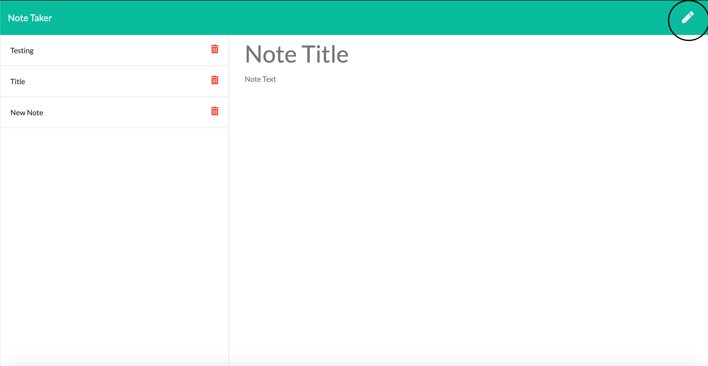

# Employee Roster Generator

[](https://opensource.org/licenses/Apache-2.0)

## Description 
This program is desigined to allow the user to take notes.  The user can make a new note, see all the notes they have created, view each note again individual, and delete any note they want.  This application is built on an node.js backend with express as the main framework.  Data is persisted in the application through the use of a json file that acts as a simiulation to a database for the program.  Data is writen to this file, read from the file, and also removed from the file just like a database.  

## Table of Contents
  
* [Installation](#installation)
* [Usage](#usage)
* [License](#license)
* [Questions](#questions)
  
  
## Installation
### View the Project Live
If you would like to view this project live, you can use the link Below.

### Run the Project Locally
** This project requires node.js so make sure that is installed on your system before doing anything else. **

* Step 1: Navigate to the directory you want to store the project. Clone this your repository to your local computer using the command below. 
```bash
git clone https://github.com/MarkMulligan97/readmeGenerator.git
```

* Step 2: Use the command line to navigate to the directory that you cloned the project.
Example:
```bash
cd directory/projectdirectory
```

* Step 3: Install the npm package dependencies from the package.json file.
```bash
npm install
```

* Step 4: While in the project directory, run the program using node using the command below.
```bash
node server.js
```

* Step 5: Once the program is started, open up your browser and go to localhost:8000.  This is the domain the program will be running on.  

## Usage 
#### How to create a new note
1.  When the home page is opened in your browser, clicked the 'get started button'.  This will take you to the notes page.
2.  To create a new note, click on the pencil on the top right hand side of the screen.  
3.  Then edit the two avaible fields (Note Title and Note text).  Make sure to put something in both fields.  
4.  Once both fields have text, you can save the note using the floppy disk icon on the top right side (* note, this icon will not appear if either field is missing input).



#### How to view a note
1.  On the notes page on the left side of the screen, click on the title of the note you want to view.

#### How to delete a note
1.  On the notes page on the left side of the screen, click the trash can button next to the title of the note you would like to delete. 


## License
This project is liscensed under an Apache license.

For more info, checkout this link:
https://opensource.org/licenses/Apache-2.0

## Questions
[My Github](https://github.com/MarkMulligan97) || mark.mulligan.jr1@gmail.com

#### How to Contact Me
Feel free to reach out to me if you have any questions about this project.  You can email me using the email listed above or can go to my github page to view my other projects and portfolio.

© Mark Mulligan 2020 All Rights Reserved.